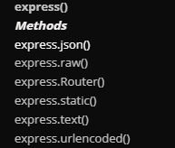

# Express Foundation

## Installing Express.js

- installation

  1. npm init [This will provide package.json file]
  2. npm i express
  3. npm i -D typescript [we are using dev dependency since we want to run typescript converting it into javascript]
  4. tsc --init [we are using this to create typescript config file]
  5. create folder src->app->app.ts & server.ts
  6. create dist folder named dist which will hold the converted js files
  7. Configure tsconfig -> "rootDir": "./src/", "outDir": "./dist",
  8. Install node typing library npm i -D @types/node
  9. Install express typing library npm i -D @types/express

#### create app.ts :

```javascript
// const express = require('express')
// we will use import here
import express from "express";
const app = express();

app.get("/", (req, res) => {
  res.send("Hello World!");
});

export default app;
```

#### create server.ts :

```javascript
import { Server } from "http";
import app from "./app";

const PORT = 5000;

let server: Server;
async function bootStrap() {
  server = app.listen(PORT, () => {
    console.log(`Example app listening on port ${PORT}`);
  });
}

bootStrap();
```

## What is Parsers, Request and Response Object

- We can not Run Ts Files Directly we have to convert into js file
- Write "tsc" command in terminal to create js files inside dist file. tsc is compiler
- "node dist/app/server.js" command in terminal will run the js file of the dist folder
- For Each Changes we have to write "tsc" so that changes are made to automate this we will write "tsc -w" this will automatically track the changes and keep te dist folder files automatically. but this will require to restart this is a problem so we will use "npm i -D nodemon" whenever any js changes it will restart the server
- now add a script in package.json file for running the file

```js

  "scripts": {
    "start:dev": "nodemon ./dist/app/server.js",

```

- now split the terminal and keep one running "tsc-w" and other terminal will run "npm run start:dev"
- this means whenever any changes in js the tsc-w will track and notify and the nodemon will restart the serve

### Parsers

[express.json() documentation](https://expressjs.com/en/api.html#express.json)

- This means when we want to post data it required to parse the data otherwise it will show undefined
- There are different type parsers
  
- We will set for each types

-app.ts

```ts
import express, { Request, Response } from "express";

const app = express();

// parsers
app.use(express.json());
//

app.get("/", (req: Request, res: Response) => {
  res.send("Hello World!");
});

app.post("/", (req: Request, res: Response) => {
  // res.send("Got a POST request");
  console.log(req.body);
  // this will log undefined so we have to use parser

  // if we want to  send a json response
  res.json({ message: "Got a POST request" });
});

export default app;
```
